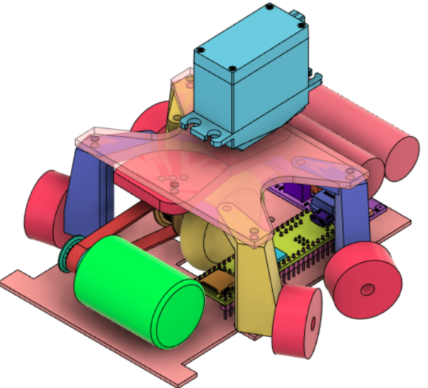

# Ñium
Lets do this motherfucker run as he was scaping from a crazy and evil god (and at the same time needs to shit)

## Goal
The follower should learn the road and improve through iterating.

## Questions
1. How to learn from repetitive runings?
   1.1 Should we write a config file after each iteration and read from it the next run?
   2.1 Which variables should we "learn"? PID values in between different marks numbers?
       For example, if we are in a rect (or curve) line, between mark 2 and 3, then we can set PID values *ad hoc** for that curve type. This approach implies that we should learn different types of curve previously. For example, have different PID values for different curvatures. Then we can measure (estimate) curvatures between two types of marks, then match the curvature of that curve for the ones saved in our *curve database*
2. Car functions?

## TODO
- [X] Include picture of the robot
- [X] define project's structure
  + Namespaces or classes? or both?
- [] create `communication` namespace
- [] configuration file:
    + [Possible implementation](https://www.daniweb.com/programming/software-development/threads/185995/how-do-i-make-a-config-file)
- [] read google style guide
- [] read google test user guide
- Buy materials:
  + [X] Batteries 
  + [X] Sensors 
  + [X] Mottors
  
## Coding standars
We are using [google C++ style guide](https://google.github.io/styleguide/cppguide.html).
They also have [Google test user guide](https://google.github.io/googletest/) that I would really like to start using.

## Relevant Information
### Cpp
- [C++ ook List](https://stackoverflow.com/questions/388242/the-definitive-c-book-guide-and-list)
- [c++ Reddit sources of information](https://www.reddit.com/r/Python/comments/2xpjg9/whats_the_best_ways_to_learn_c_for_a_professional/)
- [Failing Successfully: Reporting and Handling Errors - Robert Leahy - CppCon 2021](https://www.youtube.com/watch?v=dQaRLmM7KKk)
- [Matej Blagšič Youtube channel](https://www.youtube.com/user/4Polha/videos)
### STM32
- [] [Start Developing STM32 on Linux](https://www.instructables.com/Start-Developing-STM32-on-Linux/)
- [] [Introduction to integrating C++ on bare metal STM32](https://www.youtube.com/watch?v=7xnUsPo_fG8)
- [] [Programming STM32 on Linux](https://olayiwolaayinde.medium.com/programming-stm32-on-linux-d6a6ee7a8d8d)
### Platformio
- [Odrive](https://github.com/odriverobotics/ODrive)
We are using Platformio: a cross-platform, cross-architecture software (Python library), specially design for embedding code in different hardwares
- [What is PlatdormIO?](https://docs.platformio.org/en/latest/what-is-platformio.html)
- [Unit Testing with PlatformIO](https://piolabs.com/blog/insights/unit-testing-part-1.html)
#### Testing in PlatformIO
Now we have a special environment for testing locally. To run test in your machine run:  
`\gnium$ pio test -e testing `
## References
- [The most advanced linefollower robot from the planet](https://hbfsrobotics.com/linefollower)
- [STM32 Programming Manual](https://www.st.com/resource/en/programming_manual/pm0056-stm32f10xxx20xxx21xxxl1xxxx-cortexm3-programming-manual-stmicroelectronics.pdf) 
- [Unit Testing Examples](https://github.com/platformio/platformio-examples/tree/develop/unit-testing) 
